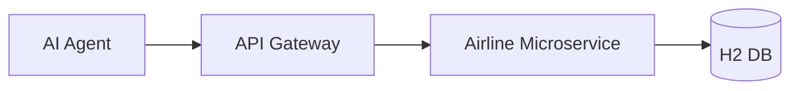

# Airline API Gateway 🛡️

A robust API Gateway built with **Spring Cloud Gateway** to manage, secure, and route requests for the Airline AI Agent ecosystem. This service acts as the central entry point for all frontend and AI Agent interactions.

## 🚀 Key Responsibilities

- **Centralized Routing:** Routes incoming requests from the AI Agent and Frontend to the specific `airline-api` microservice.
- **Security Filtering:** Implements a custom `SecurityFilter` to validate agent tokens and ensure authorized access.
- **Rate Limiting:** Protects downstream services using a `RateLimitFilter` to prevent API abuse.
- **Request Pre-processing:** Handles authentication and headers before forwarding requests to the internal network.

## 🏗️ Architecture Role

The Gateway sits between the AI Agent and the core microservices:



## 🛠️ Technology Stack

- **Framework:** Java Spring Boot 3.x
- **Gateway Engine:** Spring Cloud Gateway
- **Build Tool:** Maven
- **Environment:** Runs on Port `8081`

## 🔌 Configured Routes

| Path | Destination | Description |
| :--- | :--- | :--- |
| `/api/v1/flights/**` | `http://localhost:8080` | Flight queries and management |
| `/api/v1/booking/**` | `http://localhost:8080` | Ticket reservations |
| `/api/v1/checkin/**` | `http://localhost:8080` | Passenger check-in |

## 📦 Setup & Installation

### 1. Prerequisites
- Java 17+ installed.
- Maven installed.

### 2. Start the Gateway
```bash
# In the api-gateway root
./mvnw spring-boot:run
```
The gateway will start on **`localhost:8081`**.

---
*Developed for SE4458 - Software Architecture Assignment.*
